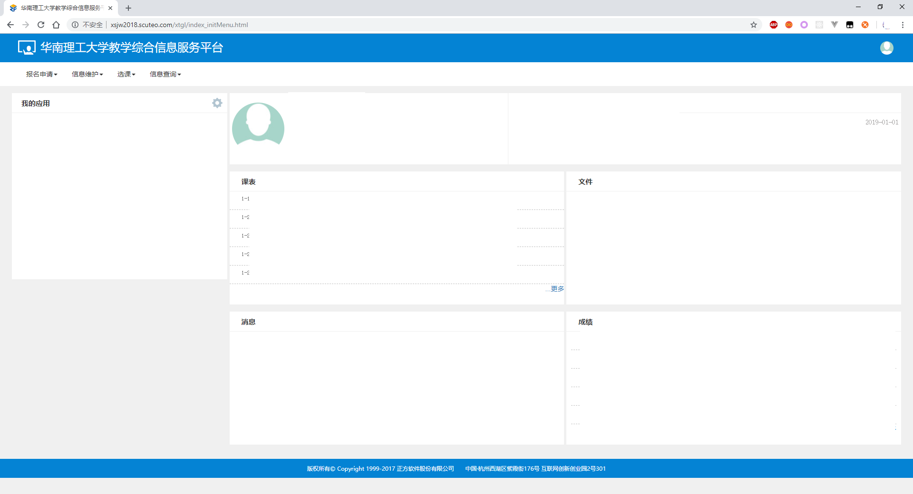

# How to login in Cookie Mode

New SCUT Educational Administration Website uses a kind of session id named <strong>JSESSION</strong> and a token named <strong>BIGipServerjwxtnew_BS80</strong> to track our login status. So if you don't want to tell me your password, you can use this mode to do a login.

### We do promise that we WON'T record your Student Id or password

## Step

1. Find the required cookies.

   For Chrome:

   1. Login to the new Educational Administration Website (a.k.a EAW).

      

   2. Click the exclamation mark (maybe with text"Not secure") at the beginning of the url bar, and click "Cookie" in the expanded popup.

      

      3. Expand "xsjw2018.scuteo.com" -> "Cookie" -> "JSESSION and BIGipServerjwxtnew_BS80 ".(The content of each cookie is hidden for security reasons. There will be a string of characters in actual.)

         

         ![Relax].\big.png)
         

   For Edge

      1. the same as Chrome

      2. Press F12 in the homepage, then call the debugger.

      3. Switch to the "Storage(存储)“ tab, expand "Cookie" in the left TreeItem bar, click the "index_initMenu.html". You may see a DataGrid as follow.
      4. 

2. Fill in the blank in AutoMata.
     1. Fill the content of each cookie in the specified blank of "Cookie Mode(JSESSION)".
      
      2. If everything goes well, now you can login into EAW in the AutoMata, and the AutoMata will tell you that you are logined by Cookie Mode.
    